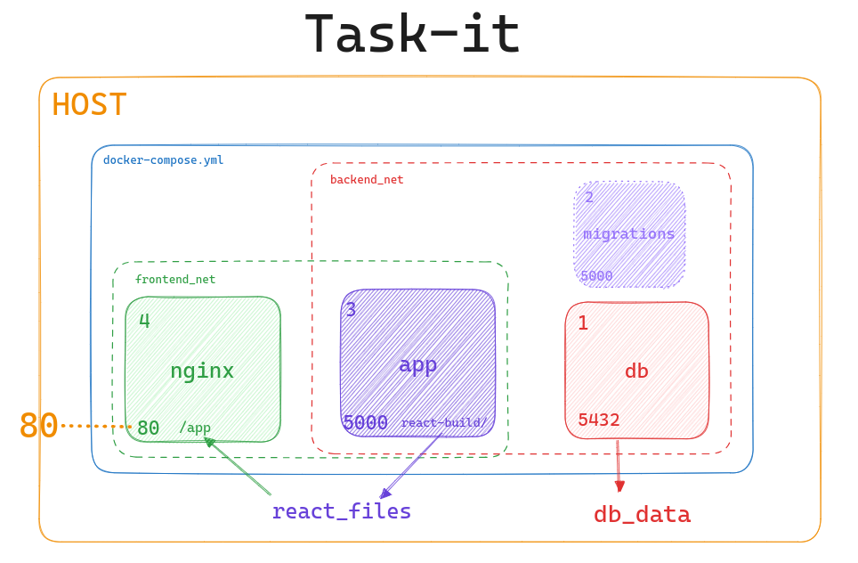

# Task-it

Task-it is a simple task management / post-it demo application.
It consists of a a REST API built with Flask for performing operations on tasks and a user interface built with React.

---

## Backend - Flask REST API

### Installing Dependencies

> **Requires [`Pipenv`](https://pipenv.pypa.io/en/latest/installation.html)**

```sh
pipenv install
```

### Configuration

The Flask app requires a few environment variables to be configured in order to function, which may be passed using a `.env` file.

```
# .env.example

DB_USER="dbuser"
DB_PASSWORD="dbpass"
DB_NAME="taskit"
DB_HOST="localhost"
DB_PORT=5431
PORT=5000
```

### Deployment

In order to deploy the Flask app one must follow these steps:

##### **1) Initialize Database**

Set up a PostgreSQL database and expose it on your local machine, configure the appropriate credentials and configure the application with these.

##### 2) Run Migrations

The app utilizes the `flask-migrate` library to manage and run migrations - generating the database schema for Task-it.
Once the database is up and running and the application has been configured to connect to it appropriately, simply execute the migrations against it:

```sh
pipenv run migrate
```

For convenience one may use the `docker-compose.yml` file and simply run the database and migration services:

```sh
docker compose up db migrations
```

> Be sure to pass the relevant environment variables and **_expose the database port_** on your local machine.

##### 3) Start App

Now simply start the application:

```sh
pipenv run start
```

---

## React UI

A simple user interface is available for interacting with the API and can served directly from the Flask application.

### Installing Dependencies

> **Requires [`Node.js 20`](https://nodejs.org/en)**

```sh
mkdir react-app/
npm install
```

### Configuration

> Required **_only if it is run as a separate process_** and not served by the backend.

An environment variable pointing to the REST API.

```
# react-app/.env/example

REACT_APP_API_URL="http://localhost:5000"
```

### Deployment

There are a few methods for deploying the UI.

##### 1) Separate Process

In a development environment you may start the application as a separate process using `npm` and configure it to talk to the backend as explained above.

```sh
npm run start
```

##### 2) Serve from Flask

You may package the static files within the Flask application and serve them directly from there.

For convenience use the custom `flask-build` npm script which compiles the files into the `react-build/` directory and reorganizes them so the flask application knows how to serve them.

You may optionally pass in the location in which the `react-build/` directory should end up, which is inside the `app/` directory.
Be sure to set appropriate permissions to be able to run the custom script.

```sh
mkdir react-app/
chmod +x ./flask-build.sh
npm run flask-build ../app
```

The built react application should end up like so:

taskit/
├── app/
├───└──**_react-build/_**
├───────├── **_static/_**
├───────└── **_index.html_**
├── react-app/

##### 3) Serve from Nginx

> See [Beginners Guide](https://nginx.org/en/docs/beginners_guide.html)

The best solution is to package and serve static files from a reverse proxy such as Nginx.

The configuration file `nginx/conf.d/taskit.conf` is set up so that it can serve the contents of the compiled `react-build/` directory from within a directory called `app/` at the root of the machine running Nginx.

app/
├── **_static/_**
└── **_index.html_**

The `docker-compose.yml` is already set up to build an Nginx image with a baked in configuration, and to obtain the static files from the application container using named volumes.

---

## Docker

In order to deploy the application as a docker container one may utilize the `Dockerfile` at the root of the repository. Building this image will result in a container which already comes bundled with the user interface.

```sh
docker build . -t taskit
```

Then run the container using the `docker run` command, but be sure to pass in the required configuration as environment variables

```sh
docker run \
-e DB_USER="dbuser" \
-e DB_PASSWORD="dbpass" \
-e DB_NAME="taskit" \
-e DB_HOST="localhost" \
-e DB_PORT=5431 \
-e PORT=5000 \
-p 5000:5000 \
taskit
```

> Be sure to have a database up and running and configured accordingly.

### Docker Compose

One may simply initialize the entire application using the `docker-compose.yml` at the root directory.
This will utilize the `Dockerfile` to build a container image ready to serve the application.
It will also front the application using an Nginx container as a reverse-proxy, and take care of initializing the database as well as running migrations against it.

```sh
docker compose up
```

> Be sure to set the appropriate environment variables for the application and migration containers to correspond to the credentials passed into the database container.

---

## Architecture

When deploying Task-it we get a 3 tier application structure:



1. **db** - The database is initialized and configured, it persists its data on the host machine.
2. **migrations** - This is a container which executes database migrations for initializing the database tables and then exits (a job). It uses the same docker image as the application itself, though it executes a different process.
3. **app** - Here we have the Flask application itself, which manages API routes and can serve static files.
4. **nginx** - Finally, an Nginx container acts as a reverse-proxy and forwards requests to the backend while acting as a single point of entry to the application. It also holds some of the static files and can serve them directly without "troubling" the backend.
